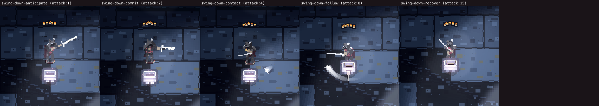
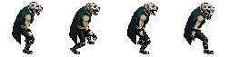
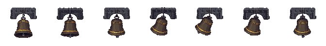
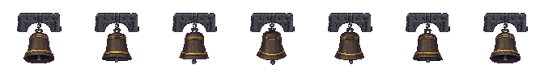

# PixelLab adoption evidence — 2026-08-31

Status: **capability proven; no candidate admitted to production**.

This is the durable record for the PixelLab work represented by PR #34. It keeps the smallest
useful rejection corpus, the paid-job manifests, the measured gate outcomes, and the native-scale
visual evidence. The remaining 134 MB working corpus stays in `.art-cache/`; no file here is an
approval receipt or a runtime asset.

## Spend ledger

| lane | calls | generations |
|---|---:|---:|
| Hero `light1`: two V3 segments, skeleton trial, Pro outfit transfer | 4 + 2 + 20 | 26 |
| Jaguar Oath-Bound: shield state, attack, template walk, V3 walk, V3 hurt | 40 + 3 + 1 + 2 + 2 | 48 |
| Judgment bell: base, Cracked state, free-form swing, bookended swing | 20 + 20 + 4 + 4 | 48 |
| **Total** | | **122** |

Account balance moved from 752 to 630. No paid call was blindly retried. The complete provider IDs,
prompts, balance checkpoints, and stop conditions live in the hash-verified manifests linked below;
credentials do not.

## Hero combat sentence

- **Pipeline:** rig-authored Anticipate, Contact, and Recover anchors → PixelLab V3 transitions →
  skeleton trial → Pro outfit transfer → Bardo compiler → real renderer at semantic ticks
  `1, 2, 4, 8, 15`.
- **Best compile:** 447 gates, 0 blocking, 1 existing waiver.
- **Decision:** reject. The generated Commit is mechanically admissible, but its sword clusters are
  heavier and its torso darker than the approved rig frame at native scale. It does not improve the
  game merely by being generated.
- [Receipt](../art/rejected/swing-down-sentence-candidate-1e3eb3a354f7.rejection.json) ·
  [manifest](../art/rejected/swing-down-sentence-candidate-1e3eb3a354f7.manifest.json)

What this proved: PixelLab can supply a semantic combat intermediate without changing simulation
timing, contacts, hitboxes, anchors, or replay state. The rig remains the source of gameplay truth.

## Jaguar Oath-Bound

- **State result:** the 8-direction shield-bearing state preserved one jaguar-skull helm, tower
  shield, club, and coherent identity. Direct V3 walk and hurt clips also retained the equipment.
- **Template result shown above:** all four walking-template frames dropped both shield and club.
- **Compile result:** 93 gates; 10 remained blocking after a measured value lift—seven
  Oath-Bound colour-placement rules and three north-key light-direction judges. The attack also
  changed the short club into a thin thrusting point and introduced cyan contact pixels.
- **Decision:** reject before purchasing north or south clips. A generated sibling identity cannot
  inherit a rig-authored role profile merely because its silhouette is promising.
- [Receipt](../art/rejected/east-walk-64px-2379cd22c277.rejection.json) ·
  [manifest](../art/rejected/east-walk-64px-2379cd22c277.manifest.json)

What this proved: `create_character_state` is strong for coherent equipment variants; named
humanoid templates are not trustworthy for armed actors. V3 with explicit equipment language is the
better animation lane, but every direction and role-specific material contract still has to pass.

## Stateful judgment bell

### Free-form V3 swing

- **Managed states:** the Base and Cracked states preserved the yoke, camera, gold band, clapper,
  proportions, and identity. The crack, bent rim, and displaced clapper read immediately at 96 px.
- **Animation:** the seven-frame free-form clip reads as a heavy pendulum swing, but the supposedly
  fixed basalt yoke is redrawn and its light drifts.
- **Compile result:** 67 gates, 7 blocking—detail density, two provisional material-placement
  limits, and four light-direction judges.
- [Receipt](../art/rejected/swing-96-93e3c0c3f03e.rejection.json) ·
  [manifest](../art/rejected/swing-96-93e3c0c3f03e.manifest.json)

### Identical-endpoint control

- Supplying the same local source as both custom endpoints made provider frames 0 and 6
  byte-identical to each other, but not to the supplied source. PixelLab redraws the endpoint rather
  than preserving its pixels.
- Light-direction failures fell from four to one and loop closure became exact, but the heavy swing
  collapsed into mostly vertical squash and subtle tilt.
- **Compile result:** 62 gates, 4 blocking—detail density, two provisional material bounds, and one
  light-direction judge.
- [Receipt](../art/rejected/bookended-96-5f2233d9b5cd.rejection.json). The preceding bell manifest
  records both animation jobs and their endpoint hashes.

What this proved: managed object **states** are production-promising. Managed object **animation**
currently trades motion quality against fixed-structure and lighting continuity; neither tested clip
satisfies both.

## Admission boundary

- Nothing entered `art/approved/` or `public/assets/`.
- No agent ran `pnpm art approve`.
- No remote PixelLab asset was modified or deleted.
- These PNGs are paired with hash-verified rejection receipts. `tests/art/rejection.test.ts` checks
  that every tracked rejection has exactly one receipt and that its image and optional manifest still
  match their recorded SHA-256 hashes.
- Simulation timing, contacts, collision, room topology, and replay hashes remain Bardo-owned.

## Next production decision

Do not spend on all eight directions or a full cast family yet. The next admissible slice should be
one weak shipped actor or one static/managed prop state with its final runtime footprint defined
first. Buy one candidate, compile it against its own measured role profile, capture it at 1× under
the shipped room light, and stop unless it is visibly better than the incumbent. Human approval is
still the only path from candidate master to production.
